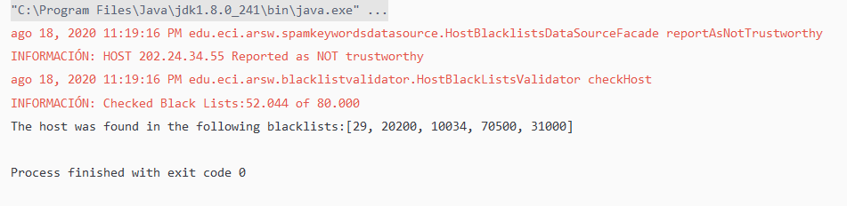
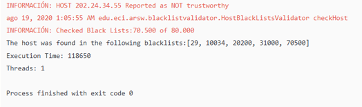
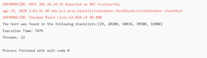
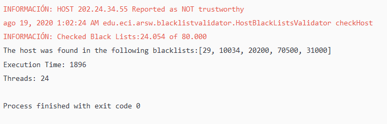
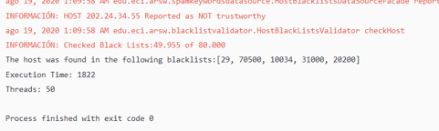
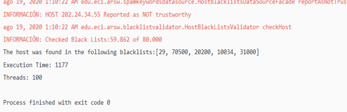
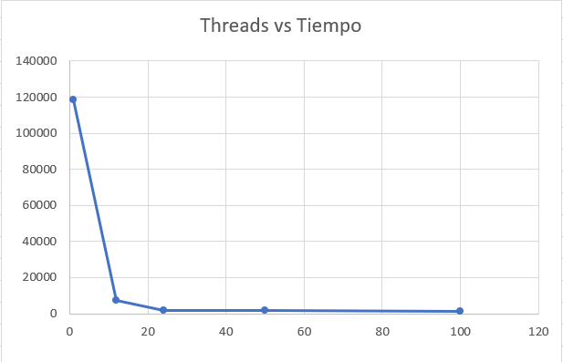

# Black List Search 

Este repositorio contiene un ejercicio de introducción a la programación de hilos en Java, también el uso en un caso concreto.

## Part l - Introduction to threads in JAVA
Change the beginning with `start()` to `run()`. How does the output change? Why?

Cuando iniciamos con `run()` únicamente se ejecuta ese método dentro del hilo actual, y no realiza una creación de un hilo. Al iniciar con `start()` se crea un nuevo hilo y con el todo su ciclo de vida, lo que ejecuta el metodo `run()` dentro de él.  

## Part ll - Black List Search Exercise

Modelo Inicial

Ejecución despues de los cambios

## Part lll - Discussion
How could the implementation be modified to minimize the number of queries in these cases? 

Podemos añadir un contador en la clase HostBlackListsValidator y hacer que este lleve la cuenta de hallazgos de la ip dada, y cuando este llegue a la cantidad necesaria para reportarlo, termine la busqueda.

What new element would this bring to the problem?

Trae consigo problemas de sincronización porque debemos garantizar que los hilos que estan buscando puedan acceder al contador a la hora de incrementarlo de manera sincronizada.

## Part lV - Performance Evaluation

+ Un único Thread.

+ Tantos hilos como el núcleo de procesamiento.

+ Tantos hilos como el doble del número de núcleos de procesamiento.

+ 50 hilos.

+ 100 hilos.

## Gráfica

According to Amdahls law, where S(n) is the theoretical improvement of performance, P the parallel fraction of the algorithm, and n the number of threads, the greater n, the better this improvement should be. Why is the best performance not achieved with the 500 threads? How is this performance compared when using 200 ?

Como podemos ver en la gráfica y con los datos recogidos en las pruebas, se ve que la mejora en tiempo de ejecución se consigue estudiando el comportamiento del programa, puesto que la mejora no es proporcional al número de hilos, cada vez se hace mas despreciable. Teniendo en mente esa hipótesis la diferencia entre 500 hilos y 200 hilos en este caso no tendría un cambio notorio.

How does the solution behave using as many processing threads as cores compared to the result of using twice as much?

El rendimiento usando el doble del número de procesadores es aproximadamente 1/4 del rendimiento usando tantos hilos como procesadores.

According to the above, if for this problem instead of 100 threads in a single CPU could be used 1 thread in each of 100 hypothetical machines, Amdahls law would apply better ?. If x threads are used instead of 100/x distributed machines (where x is the number of cores of these machines), would it be improved? Explain your answer.

El rendimiendo no mejorará, debido a que se necesita comunicar todas las máquinas entre ellas para poder dar un resultado final, se estarían mal gastando lo recursos físicos, según la hipótesis con la que hemos trabajado, el crecimiento a pesar de ser despreciable tiene un crecimiento asegurado siempre y cuanto se consiga un comportamiento lineal.

## Autor
> Davor Javier Cortés

## Licencia
Este proyecto está licenciado bajo la GNU General Public License v3.0, para más información ver la [LICENCIA](LICENSE.txt).
